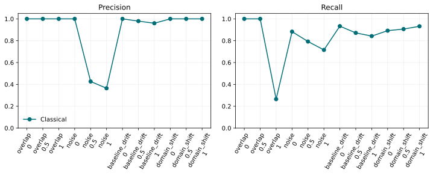

Scientific benchmarks
=====================

DeepPeak includes a deterministic benchmark covering increasing pulse overlap,
noise, baseline drift, and pulse-shape domain shift. Each trace retains exact
peak locations and amplitudes. Evaluation uses one-to-one Hungarian matching
within a five-sample tolerance and reports precision, recall, mean absolute
timing error, count error, amplitude error, and traces per second.

.. important::

   The checked-in results below are measured, not illustrative. The default
   run measures the dependency-light classical baseline. DenseNet, WaveNet,
   and U-Net are included only when their trained ``.keras`` models are passed
   to the runner; absent models are never assigned fabricated scores.

Reproduce the benchmark
-----------------------

From the repository root, run:

.. code-block:: console

   python tools/run_benchmarks.py

To compare trained neural models on exactly the same traces:

.. code-block:: console

   python tools/run_benchmarks.py \
      --model DenseNet=artifacts/densenet.keras \
      --model WaveNet=artifacts/wavenet.keras \
      --model U-Net=artifacts/unet.keras

The command regenerates ``results.csv`` and ``benchmark-summary.svg``. The
seed, scenario severities, trace count, matching tolerance, and detector
defaults are fixed in the source. The CSV is intentionally small and is the
canonical machine-readable benchmark table.

Calibration and uncertainty
---------------------------

``expected_calibration_error`` measures binary confidence calibration, while
``bootstrap_interval`` supplies deterministic percentile confidence intervals.
Neural studies should report calibration error and 95% bootstrap intervals
alongside point estimates. Models that do not emit probabilities should leave
calibration fields missing rather than reinterpret amplitudes as confidence.

.. literalinclude:: benchmarks/results.csv
   :language: text
   :lines: 1-13
